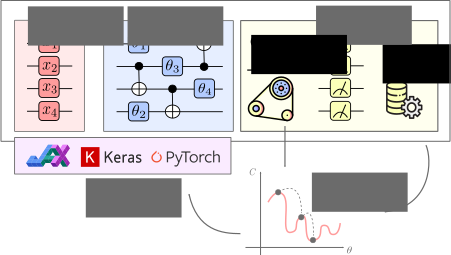

Building your first Quantum Model
---------------------------------

In order to build a Quantum Model you need to define three fundamental ingredients:

* an ``Encoder`` which takes care of embedding classical data inside of a Quantum Circuit;
* (`optionally`) A parametrized quantum ``Circuit`` defining the actual computation the model will perform;
* a ``Decoder`` in charge of decoding the quantum information contained in the final state.

Such that a single evaluation of the model, divided in the three steps `Encoding` -> `Computation` -> `Decoding`, takes as input classical data and outputs classical data once again.

In ``qiboml`` we provide some standard pre-defined encoding and decoding layers, whereas the `Computation` part can be delegated to any ``qibo`` circuit (some standard quantum circuit ansaetze are available as well). The different pieces can be joined together through a ``qiboml`` interface, which exposes a ``QuantumModel`` object in one of the popular ML frameworks (such as ``torch`` and ``keras``).

Therefore, building a ``qiboml`` model is rather immediate. For instance using the ``torch`` interface:

.. testcode::

   import torch
   from qibo import Circuit, gates
   from qiboml.models.encoding import PhaseEncoding
   from qiboml.models.decoding import Probabilities
   from qiboml.interfaces.pytorch import QuantumModel

   # define the encoding
   encoding = PhaseEncoding(nqubits=3)
   # define the decoding
   decoding = Probabilities(nqubits=3)
   # build the computation circuit
   circuit = Circuit(3)
   circuit.add((gates.H(i) for i in range(3)))
   circuit.add((gates.CNOT(0,1), gates.CNOT(0,2)))
   circuit.draw()
   # join everything together through the torch interface
   quantum_model = QuantumModel(encoding, circuit, decoding)
   # run on some data
   data = torch.randn(3)
   outputs = quantum_model(data)

Note that the :class:`qiboml.interfaces.pytorch.QuantumModel` object is a ``torch.nn.Module``, it is thus fully compatible and integrable with the standard ``torch`` API. For instance, it can be concatenated to other ``torch`` layers through ``torch.nn.Sequential``:

.. testcode::

   linear = torch.nn.Linear(8, 3)
   activation = torch.nn.Tanh()
   model = torch.nn.Sequential(
       linear,
       activation,
       quantum_model,
   )
   outputs = model(torch.randn(8))

and it can be trained using a ``torch.optim`` optimizer:

.. testcode::

   optimizer = torch.optim.Adam(model.parameters())
   for _ in range(10):
       data = torch.randn(8)
       target = 2 * data
       optimizer.zero_grad()
       outputs = model(data)
       loss = torch.nn.functional.mse_loss(outputs, target)
       loss.backward()
       optimizer.step()
