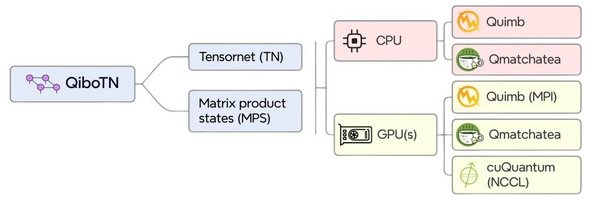

.. title::
   QiboTN

What is QiboTN?
===============

Qibotn is an high-level library which integrates tensor network simulation within
the `Qibo <https://github.com/qiboteam/qibo>`_ ecosystem.

If you are familiar with Qibo, you will be well aware of the modularity we provide
through the use of our backends: after building a specific algorithm or quantum
circuit, any of our backends can be selected to perform operations on the
desired hardware (classical or quantum).

Here, we extend this modularity to one of the most famous quantum inspired simulation
technique.

We do this by relying on well-known and maintained packages, and integrating their
operation into our own dedicated backends.

As shown in the figure above, we currently support three different backends, which
correspond to the three mentioned packages:
   - `cuQuantum <https://github.com/NVIDIA/cuQuantum>`_: an NVIDIA SDK of optimized libraries and tools for accelerating quantum computing workflows (we refer to the specific `Cutensornet <https://docs.nvidia.com/cuda/cuquantum/latest/cutensornet/index.html>`_  library);
   - `quimb <https://quimb.readthedocs.io/en/latest/>`_: an easy but fast python library for ‘quantum information many-body’ calculations, focusing primarily on tensor networks;
   - `Quantum Matcha Tea <https://www.quantumtea.it/>`_: a logical quantum computer emulator powered by matrix product states. Read `here <https://github.com/qiboteam/qibotn/blob/restore/examples/qmatchatea_intro/qmatchatea_introduction.ipynb>`_ if you want to have an example on how using the Quantum Matcha Tea backend.

..  warning::

   There are currently two ways to use the three backends (`qmatchatea` is
   slightly different from the others), but we are working to standardize the interface.

Thanks to the mentioned packages, we currently support some tensor network ansatze:
Matrix Product States (MPS) on any mentioned backend, Tree Tensor Networks (TTN)
through the Quantum Matcha Tea backend and a more general Tensor Network (TN) ansatz through
Cutensornet and Quimb.

Supported simulation features
^^^^^^^^^^^^^^^^^^^^^^^^^^^^^

We support Tensor Network contractions to:

- dense vectors (all the backends)
- expecation values of given Pauli string (Cutensornet and Qmatchatea)

The supported HPC configurations are:

- single-node CPU through Quimb and Qmatchatea
- single-node GPU or GPUs through Cutensornet and Qmatchatea
- multi-node multi-GPU with Message Passing Interface (MPI) through Cutensornet
- multi-node multi-GPU with NVIDIA Collective Communications Library (NCCL) through Cutensornet

How to Use the Documentation
============================

Welcome to the comprehensive documentation for QiboTN! This guide will help you navigate through the various sections and make the most of the resources available.

1. **Getting started**: Begin by referring to the
   :doc:`/getting-started/installation/` guide to set up the ``QiboTN`` library in your environment.

2. **Tutorials**: Explore the :doc:`getting-started/quickstart/` section for basic usage examples

Contents
--------

.. toctree::
   :maxdepth: 2
   :caption: Introduction

   getting-started/index

.. toctree::
    :maxdepth: 1
    :caption: Main documentation

    api-reference/qibotn
    Developer guides <https://qibo.science/qibo/stable/developer-guides/index.html>

.. toctree::
    :maxdepth: 1
    :caption: Documentation links

    Qibo docs <https://qibo.science/qibo/stable/>
    Qibolab docs <https://qibo.science/qibolab/stable/>
    Qibocal docs <https://qibo.science/qibocal/stable/>
    Qibosoq docs <https://qibo.science/qibosoq/stable/>
    Qibochem docs <https://qibo.science/qibochem/stable/>
    Qibotn docs <https://qibo.science/qibotn/stable/>
    Qibo-cloud-backends docs <https://qibo.science/qibo-cloud-backends/stable/>

Indices and tables
==================

* :ref:`genindex`
* :ref:`modindex`
* :ref:`search`
